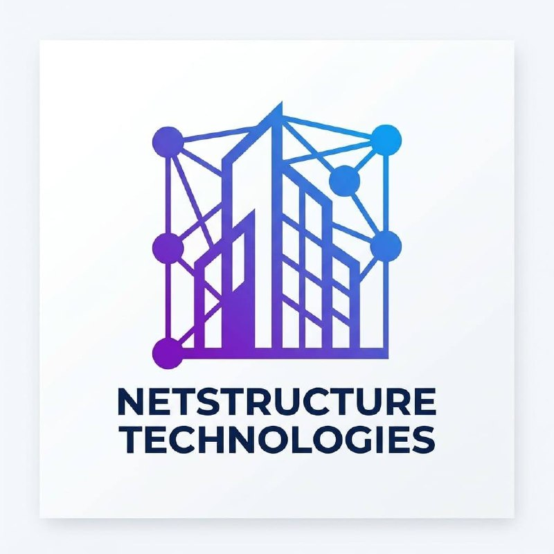

# 🔍 CorpScope



**Company intelligence at your fingertips.**

© 2026 Groundwork Labs LLC — California

---

## What is CorpScope?

CorpScope enriches company data from a domain, name, or LinkedIn URL. It scrapes real website metadata, analyzes DNS/MX records, detects email providers, tech stack signals, and social profiles — all in one API call.

Perfect as an MCP server for AI assistants, or as a standalone API for sales teams, recruiters, and investors.

## Quick Start

```bash
git clone https://github.com/ZayM511/corpscope-api.git
cd corpscope-api
npm install
cp .env.example .env
npm start
```

Server runs at `http://localhost:3000`

## API Endpoints

| Method | Endpoint | Auth | Description |
|--------|----------|------|-------------|
| GET | `/` | No | API info & endpoints |
| GET | `/health` | No | Health check + uptime |
| GET | `/legal` | No | Company & legal info |
| GET | `/api/verify` | Key | Verify API key + quota |
| POST | `/api/company/enrich` | Key | Enrich single company |
| POST | `/api/company/bulk` | Key | Bulk enrich (Basic/Pro) |

## Authentication

```
x-api-key: YOUR_API_KEY
```

**Test Keys:**
| Key | Plan | Requests/mo |
|-----|------|-------------|
| `sk_test_free_001` | Free | 100 |
| `sk_test_basic_002` | Basic | 1,000 |
| `sk_test_pro_003` | Pro | 10,000 |

## Usage Examples

### Enrich by Domain
```bash
curl -X POST http://localhost:3000/api/company/enrich \
  -H "Content-Type: application/json" \
  -H "x-api-key: sk_test_free_001" \
  -d '{ "domain": "stripe.com" }'
```

### Enrich by Name
```bash
curl -X POST http://localhost:3000/api/company/enrich \
  -H "Content-Type: application/json" \
  -H "x-api-key: sk_test_free_001" \
  -d '{ "name": "Stripe" }'
```

### Response
```json
{
  "success": true,
  "data": {
    "company": {
      "name": "Stripe",
      "domain": "stripe.com",
      "url": "https://stripe.com",
      "description": "Financial infrastructure for the internet",
      "logo": "https://stripe.com/img/v3/...",
      "socials": {
        "twitter": "https://twitter.com/stripe",
        "linkedin": "https://linkedin.com/company/stripe"
      },
      "contact": {
        "email": "info@stripe.com",
        "phone": null,
        "address": null
      },
      "scraped": true
    },
    "dns": {
      "emailProvider": "Google Workspace",
      "emailSecurity": { "spf": true, "dmarc": true },
      "techSignals": ["Google Search Console", "Facebook Business", "Stripe"],
      "mxRecordCount": 5
    },
    "processingMs": 1240
  },
  "meta": { "requestId": "abc123", "plan": "free", "remaining": 99 }
}
```

### Bulk Enrich (Basic/Pro only)
```bash
curl -X POST http://localhost:3000/api/company/bulk \
  -H "Content-Type: application/json" \
  -H "x-api-key: sk_test_pro_003" \
  -H "x-terms-accepted: true" \
  -d '{
    "companies": [
      { "domain": "stripe.com" },
      { "domain": "openai.com" },
      { "name": "Anthropic" }
    ]
  }'
```

## What You Get

| Data Point | Source |
|------------|--------|
| Company name & description | Website meta tags |
| Logo / OG image | Website meta tags |
| Social links (LinkedIn, Twitter, GitHub, Facebook) | Website link scraping |
| Contact email & phone | Website body text |
| Email provider (Google, Microsoft, Zoho, etc.) | MX record analysis |
| Email security (SPF, DMARC) | TXT record analysis |
| Tech stack signals (HubSpot, Salesforce, etc.) | DNS TXT records |

## Subscription Plans

| Plan | Price | Requests/mo | Bulk |
|------|-------|-------------|------|
| Free | $0 | 100 | ❌ |
| Basic | $9.99 | 1,000 | ✅ (25/req) |
| Pro | $29.99 | 10,000 | ✅ (25/req) |

## MCP Integration

Use CorpScope as a Model Context Protocol server:
```json
{
  "mcpServers": {
    "corpscope": {
      "url": "http://localhost:3000",
      "apiKey": "sk_test_free_001"
    }
  }
}
```

## Deployment

### Docker
```bash
docker build -t corpscope-api .
docker run -p 3000:3000 --env-file .env corpscope-api
```

### Render
render.yaml included — connect your repo and deploy.

## Legal

- [Terms of Service](legal/TermsOfService.md)
- [Privacy Policy](legal/PrivacyPolicy.md)

---

**CorpScope** — A Groundwork Labs LLC Product
© 2026 All Rights Reserved
